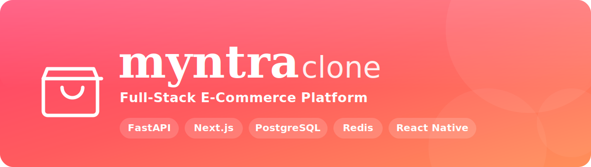
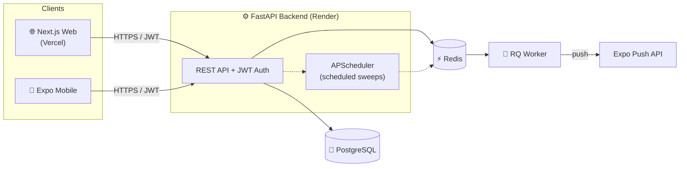

<div align="center">



### A production-grade shopping platform with a shared backend powering both **web** and **mobile** clients

[](https://myntra-clone-fullstack-ivory.vercel.app)
[](https://myntra-api-nkz6.onrender.com/docs)
[](https://github.com/ShivamPawaskar/myntra-clone-fullstack/actions)
[](./LICENSE)

<br/>


<br/>


**[🌐 Live Store](https://myntra-clone-fullstack-ivory.vercel.app)** • **[⚙️ Live API](https://myntra-api-nkz6.onrender.com/docs)** • **[📄 Design Decisions](./DESIGN_DECISIONS.docx)**

<br/>

`6 engineered features`&nbsp;&nbsp;•&nbsp;&nbsp;`61 passing tests`&nbsp;&nbsp;•&nbsp;&nbsp;`dual-DB CI (SQLite + PostgreSQL)`&nbsp;&nbsp;•&nbsp;&nbsp;`live on Vercel + Render`

</div>

---

## ✨ Overview

A **Myntra-style online shopping platform** engineered to production standards — real concurrency control, idempotency guarantees, and scalability built in from the ground up. A single **FastAPI** backend serves both a **Next.js** web storefront and a **React Native (Expo)** mobile app. The same code runs on **SQLite** in development and **PostgreSQL** in production, and the whole thing is continuously tested in CI and **deployed live** on Vercel + Render.

> 🎓 Built as an internship project around **six engineered requirements**, then extended with a full checkout flow, reviews, coupons, order tracking, and faceted search.

---

## 🚀 Live Demo

| Service | URL | Stack |
| :------ | :-- | :---- |
| 🛍️ **Storefront** | **[myntra-clone-fullstack-ivory.vercel.app](https://myntra-clone-fullstack-ivory.vercel.app)** | Next.js · Vercel |
| ⚙️ **REST API** | **[myntra-api-nkz6.onrender.com](https://myntra-api-nkz6.onrender.com/health)** · [`/docs`](https://myntra-api-nkz6.onrender.com/docs) | FastAPI · Render |

> ⏱️ **Heads-up:** the API runs on a free tier and *sleeps when idle* — the **first** load after a break can take ~30–50s to wake up, then it's fast. Try logging in with **`test@demo.com`** / **`secret123`**, or sign up fresh.

<!-- 📸 Tip: drop screenshots into a /docs/screenshots folder and embed them here to make this section pop. -->

---

## 🎯 Core Features

The six engineered modules, each solving a hard real-world problem:

| # | Module | What makes it production-grade |
| :- | :----- | :----------------------------- |
| 1️⃣ | **Hybrid Recently-Viewed** | Local cache (localStorage / AsyncStorage) for instant reads **+** server sync. Duplicate-proof via a DB `UNIQUE(user, product)` constraint & race-safe upsert, capped at 20, with anonymous→login merge that preserves newest-first order. |
| 2️⃣ | **Theme & Dark Mode** | Centralized **semantic design tokens** — zero hardcoded colors. Auto-detects OS appearance, manual toggle, persisted, no-flash on load, and new themes drop in without touching components. |
| 3️⃣ | **Push Notifications** | Event-driven delivery via a **Redis + RQ** queue with **exponential-backoff retries**, per-user **rate limiting**, dead-token cleanup, and foreground/background/terminated handling on Expo. |
| 4️⃣ | **Transaction History** | Server-side **filter / sort / pagination** for 10k+ rows, **idempotent webhooks** (DB constraint + HMAC), append-only **audit log**, **streaming CSV** export & on-demand **PDF receipts**. |
| 5️⃣ | **Concurrency-Safe Cart** | **Optimistic locking** (version column) defeats lost updates from multiple devices. Clean active / *Save-for-Later* split, plus stock, price-change & discontinued validation at checkout. |
| 6️⃣ | **Recommendation Engine** | "You May Also Like" from **4 weighted signals** (category, wishlist overlap, browsing, popularity fallback) in **one index-backed SQL query** — no N+1, bounded cost, graceful cold start. |

### 🌟 Beyond the brief

> Extra features added on top of the requirements:

🛒 **Checkout + demo payment gateway** (Card / UPI / Net Banking / COD) &nbsp;•&nbsp; ⚡ **Buy Now** &nbsp;•&nbsp; ⭐ **Reviews & ratings** with *Verified Purchase* badges &nbsp;•&nbsp; 🏷️ **Coupons** &nbsp;•&nbsp; 📦 **Order-status tracking** timeline &nbsp;•&nbsp; 🔎 **Faceted filter sidebar** (categories, brands, colors, price slider) &nbsp;•&nbsp; 👤 **User profiles** &nbsp;•&nbsp; ❤️ **Wishlist**

---

## 🏗️ Architecture



---

## 🧰 Tech Stack

<table>
<tr><td><b>Backend</b></td><td>FastAPI · SQLAlchemy 2.0 (async) · Alembic · Pydantic · PostgreSQL / SQLite · Redis + RQ · APScheduler · JWT (python-jose) · ReportLab · Docker</td></tr>
<tr><td><b>Web</b></td><td>Next.js 14 (App Router) · React · TypeScript</td></tr>
<tr><td><b>Mobile</b></td><td>React Native · Expo</td></tr>
<tr><td><b>Tooling / DevOps</b></td><td>pytest · GitHub Actions (CI) · Render · Vercel</td></tr>
</table>

---

## 📂 Project Structure

```
myntra-clone/
├── backend/                 # FastAPI + SQLAlchemy + Redis/RQ + Alembic — the shared API
│   ├── app/
│   │   ├── models/          # SQLAlchemy ORM models
│   │   ├── routers/         # API endpoints
│   │   ├── services/        # business logic (cart, checkout, recommender, …)
│   │   ├── workers/         # RQ worker + APScheduler sweeps
│   │   └── tests/           # 61 pytest tests
│   └── render.yaml          # one-click Render deploy
├── web/                     # Next.js 14 storefront
├── mobile/                  # React Native (Expo) app
├── .github/workflows/       # CI: SQLite + PostgreSQL test matrix
├── run.sh / run.ps1         # one-command full-stack dev launcher
└── DESIGN_DECISIONS.docx    # full technical justification
```

---

## ⚡ Quick Start

> **One command** sets up everything (venv, pip, npm, DB seed) and launches the full stack:

```bash
./run.sh          # macOS / Linux / Git Bash
```
```powershell
./run.ps1         # Windows PowerShell
```

Then open **http://localhost:3000** 🎉

<details>
<summary><b>🔧 Manual setup (per service)</b></summary>

<br/>

**Backend** — requires Python 3.12–3.14
```bash
cd backend
python -m venv .venv && source .venv/bin/activate   # Windows: .venv\Scripts\activate
pip install -r requirements-dev.txt
cp .env.example .env
python -m app.seed
uvicorn app.main:app --reload                       # http://localhost:8000
```

**Web**
```bash
cd web
npm install
cp .env.example .env.local
npm run dev                                          # http://localhost:3000
```

**Mobile**
```bash
cd mobile
npm install
npx expo start                                       # scan the QR with Expo Go
```
</details>

---

## 🧪 Testing & CI


```bash
cd backend && pytest app/tests          # 61 unit + integration tests
```

Every push runs the suite in **GitHub Actions** against **both SQLite (Python 3.12 & 3.14) and a real PostgreSQL** service — so dev-vs-prod SQL divergences (timezone handling, dialect quirks, foreign-key enforcement) are caught automatically before they ship.

---

## ☁️ Deployment

| Component | Platform | Config | CI/CD |
| :-------- | :------- | :----- | :---- |
| Backend (API + Postgres + Redis) | **Render** | [`render.yaml`](./render.yaml) | auto-deploys on push, migrations run automatically |
| Web | **Vercel** | [`web/vercel.json`](./web/vercel.json) | auto-deploys on push |
| Mobile | **EAS** | `mobile/eas.json` | builds for iOS / Android |

The identical backend code runs on **SQLite (dev)** and **PostgreSQL (prod)** — only `DATABASE_URL` changes.

---

## 📜 License

Released under the **[MIT License](./LICENSE)**.

<div align="center">

<br/>

**⭐ If you find this project useful, consider giving it a star!**

Built with ❤️ by **[Shivam Pawaskar](https://github.com/ShivamPawaskar)**

</div>
